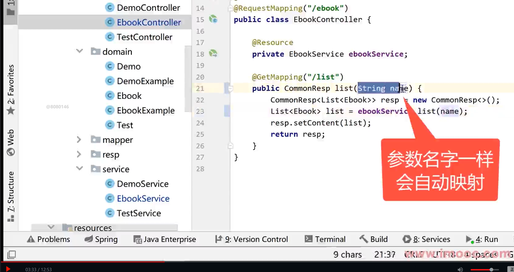
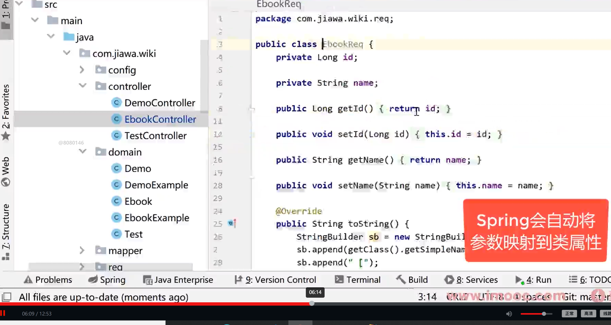

## 2022/2/9 

### 输入test/list的逻辑

入口在TestController,/test/list对应的方法返回的是testService.list()

而testService.list()方法会调用TestMapper的list()方法

TestMapper再去找对应的xml

### 修改mybatis-generator的配置文件generator.xml

修改连接还有domain mapper的targetPackage所在位置

## 2022/2/10

### 用Mybatis generator生成的demoMapper的selectByExample
demoMapper.selectByExample(null);类似于 where. null 意味着select all

### 快捷键
Ctrl+Alt+v

### EbookExample.Criteria 类似于 where

## 2022/2/11
3-7有提到自动映射




GET http://localhost:8881/ebook/list?name=Spring
请求参数是name,类也是name,spring可以自动映射

## 2022/2/13


### web/dist
通过IDEA npm tab的build生成的文件

### web/public
访问这里的资源需要href="<%= BASE_URL%>favicon.ico"
### src/assets
静态文件

### src/router 
各种页面对应的路由
比如最开始的/和/about
/about使用了懒加载，不会一次性加载所有的内容

### src/App.vue
初始页面

### main.ts
启动配置文件
create(App) 对应App.vue
mount('#app')中的#app可以让人联想到选择器 肯定有一个div id = "app"
package-lock.json

**main.ts将内容页App.vue渲染到index.html,完成页面显示**


### Somethingelse 
_What is this?_ Alter from github
We found potential security vulnerabilities in your dependencies.
Only the owner of this repository can see this message.

### 2/14

页面布局: https://2x.antdv.com/components/layout-cn
```vue
<a-layout>
    <a-layout-header>Header</a-layout-header>
    <a-layout>
      <a-layout-sider>Sider</a-layout-sider>
      <a-layout-content>Content</a-layout-content>
    </a-layout>
    <a-layout-footer>Footer</a-layout-footer>
  </a-layout>
```
### 3/8
重新组织了App.vue使用了
```vue
<template>
  <the-header/>
  <router-view/>
  <the-footer/>
</template>
```
<router-view>访问views对应的文件
<the-header>和<the-footer>对应的是components的文件
the-footer.vue和the-header.vue

### 3/9
ref可以用来绑定数据要ebooks.value = 